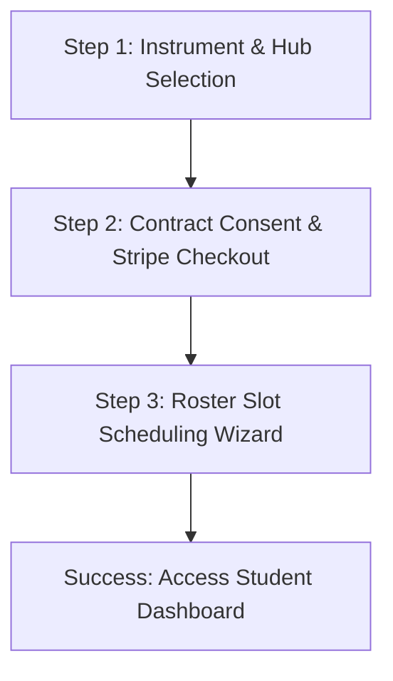

# Frictionless UX/UI Specification Blueprint

This document defines the user experience mappings, visual design tokens, and interaction flows designed to deliver a premium, low-friction, high-fidelity experience for students, parents, and instructors.

---

## 1. Visual Design System & Branding Tokens

To appeal to both younger demographics (ages 9–17 looking for authentic "rock star" spectacles) and adults (reclaiming musical passions), the branding uses a dual-engine dark-mode design system. It blends a high-energy stage aesthetic with clear, corporate CRM readability.

### 1.1 Color Palette Tokens
*   **Deep Base (Background):** `#080a0f` – Clean black-indigo slate that absorbs background noise.
*   **Surfaces (Cards & Modals):** `rgba(18, 23, 34, 0.65)` with `backdrop-filter: blur(12px)` and `border: 1px solid rgba(255, 255, 255, 0.08)` (Glassmorphism).
*   **Primary Accent (Neon Violet):** `#8b5cf6` – Interactive hover transitions, primary CTA buttons, and active routing indications.
*   **Secondary Accent (Neon Pink):** `#ec4899` – Interactive tags, highlight gradients, and progress indicators.
*   **System Alerts:**
    *   *Optimal Latency:* `#10b981` (Emerald Green)
    *   *Warning / Minor Lag:* `#f59e0b` (Amber Orange)
    *   *Critical / Closed Roster:* `#ef4444` (Rose Red)
    *   *Muted / Inactive:* `#64748b` (Slate Gray)

### 1.2 Typography Hierarchy
*   **Headers & Titles:** *Outfit* (Sans-Serif, weights 600, 700, 800) – Wide, modern, high-impact headings.
*   **Body & Interface Copy:** *Inter* (Sans-Serif, weights 300, 400, 500, 600) – Neutral, highly readable at small sizes.

---

## 2. Low-Friction User Journeys

### 2.1 Three-Step Student Onboarding Flow
To prevent cart abandonment and establish the contract rules, the onboarding flow consolidates account setup into three steps:

1.  **Selection Screen:** Simple selection cards containing instrument options (Piano, Guitar, Violin, Voice, Drums) and location hubs (Thornton, Westminster, Broomfield).
2.  **Stripe Checkout Integration & Commitment Lock:**
    *   *UX Rule:* The interface must explicitly state: *"Pricing is locked at $299/mo with a mandatory 90-day minimum commitment."*
    *   *Control:* A mandatory checkbox lock must be clicked before routing to Stripe Checkout.
3.  **Scheduling Wizard:** Once checkout succeeds, the user is immediately redirected to choose their weekly Tuesday/Wednesday rehearsal slot.

---

### 2.2 Live WebRTC Jam Space Portal
The virtual rehearsal room prioritizes audio connection speed and simple monitoring.

*   **Microphone Input Metering:** A real-time, 10-bar CSS visualizer indicates active local mic input.
*   **Instant Audio Mute:** Large, unmistakable toggle buttons (Violet for active, Rose Red for muted) for mic control.
*   **RTT Latency Widget:** A diagnostic bar displaying round-trip ping, estimated jitter, and packet loss. If latency spikes above 25ms, a warning alert suggests optimizations (e.g., closing background downloads).
*   **Automatic Stream Routing:** Incoming audio streams play instantly without requiring manual output routing.

---

### 2.3 DRM-Synced Lesson Workspace
This layout provides a side-by-side splitscreen view to synchronize instructional videos with sheet music tablature.

*   **Splitscreen Ratio:** `1fr 1fr` grid on desktop, stacking into a single column on mobile.
*   **Time-Linked Tablature Scrolling:**
    *   As the instruction video plays, the tablature component scrolls automatically to highlight the active measure in a violet tint.
    *   *Interactive Sync:* Clicking any measure on the tablature card jumps the video player to that exact timestamp.
*   **DRM Access Locks:** Unauthenticated users or accounts flagged as `past_due` see a blur layer with a recovery billing button, rather than raw video files.

---

### 2.4 Conflict-Free Roster Scheduler
The calendar booking interface prevents scheduling collisions and respects physical capacity constraints.

*   **Grid layout:** Time slots are divided into 1.5-hour blocks (4:00 PM – 5:30 PM, 5:30 PM – 7:00 PM, 7:00 PM – 8:30 PM) on Tuesdays and Wednesdays.
*   ** Roster Caps Indicator:**
    *   Each slot displays a progress bar indicating current cohort density (e.g., `8/10 students`).
    *   *Atomic State Changes:* If a slot hits `10/10`, the select button is disabled, the tag switches to **"CAPPED"**, and the action shifts to **"Join Waitlist"**.
*   **Staff Double-Booking Warnings:** The administrative dashboard highlights schedule conflicts in red if a director is assigned to overlapping blocks.

---

## 3. Error Recovery & Safety UI

*   **Payment Failure Block (`past_due` state):**
    *   *UX Pattern:* Instead of a general error screen, users with payment failures are routed to a dashboard modal: *"Action Required: Update payment details to restore your roster reservation."*
    *   *Action:* Contains a direct link to the Stripe Customer Portal.
*   **Microphone Denied State:** If browser microphone permissions are rejected, the Jam Space shows a warning icon: *"Microphone Blocked. Enable mic permissions in your browser address bar to participate."*
